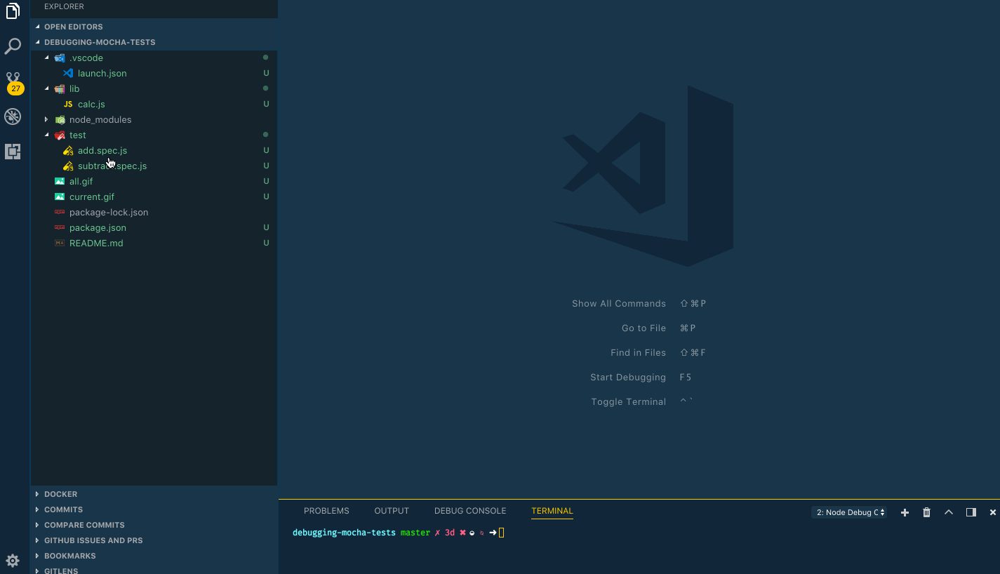
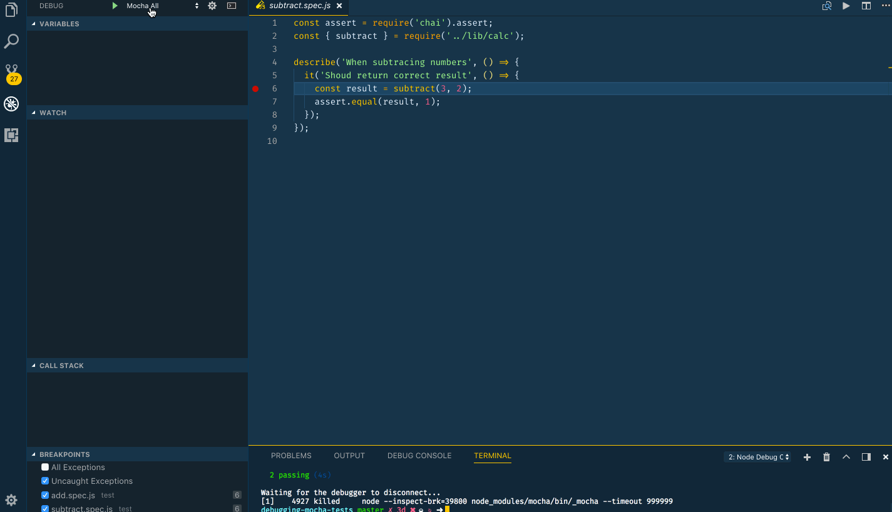

# Debugging Mocha tests in Visual Studio Code

by [Bruce Bentley ( @bruce_bentley )](https://github.com/brucebentley/)

This recipe shows how to use the built-in Node Debugger to debug [Mocha](https://mochajs.org/) tests.

## The example

The test folder contains two files that test the lib/calc.js file.

To try the example you'll need to install dependencies by running:

```sh
$ npm install
```

## Configure launch.json File for your test framework

+ Click on the Debugging icon in the Activity Bar to bring up the Debug view. Then click on the gear icon to configure a launch.json file, selecting **Node** for the environment:

+ Replace content of the generated launch.json with the following configurations:

   ```json
   {
       "version": "0.2.0",
       "configurations": [
           {
               "type": "node",
               "request": "launch",
               "name": "Mocha All",
               "program": "${workspaceFolder}/node_modules/mocha/bin/_mocha",
               "args": ["--timeout", "999999", "--colors", "${workspaceFolder}/test"],
               "console": "integratedTerminal",
               "internalConsoleOptions": "neverOpen"
           },
           {
               "type": "node",
               "request": "launch",
               "name": "Mocha Current File",
               "program": "${workspaceFolder}/node_modules/mocha/bin/_mocha",
               "args": ["--timeout", "999999", "--colors", "${file}"],
               "console": "integratedTerminal",
               "internalConsoleOptions": "neverOpen"
           }
       ]
   }
   ```

If you don't have all of your tests under a common "test" directory, then the following configurations can be used. It will recursively search for all \*.test.js files except for those that are in a node_modules directory.

   ```json
   {
       "version": "0.2.0",
       "configurations": [
           {
               "type": "node",
               "request": "launch",
               "name": "Mocha All",
               "program": "${workspaceFolder}/node_modules/mocha/bin/_mocha",
               "args": ["--timeout", "999999", "--colors", "'${workspaceFolder}/{,!(node_modules)/}*/*.test.js'"],
               "console": "integratedTerminal",
               "internalConsoleOptions": "neverOpen"
           },
           {
               "type": "node",
               "request": "launch",
               "name": "Mocha Current File",
               "program": "${workspaceFolder}/node_modules/mocha/bin/_mocha",
               "args": ["--timeout", "999999", "--colors", "${file}"],
               "console": "integratedTerminal",
               "internalConsoleOptions": "neverOpen"
           }
       ]
   }
   ```

If you are running mocha will multiple arguments, you may consider creating an opt file that store all these arguments (i.e name it as mocha.opts).

Example file contents with mocha arguments: 

   ```sh
   --timeout 999999
   --colors
   --full-trace  
   ```

Reference the mocha opts file with --opts in configuration as shown below

   ```json
   {
       "version": "0.2.0",
       "configurations": [
           {
               "type": "node",
               "request": "launch",
               "name": "Mocha Test All with Options",
               "program": "${workspaceFolder}/node_modules/mocha/bin/_mocha",
               "args": ["--opts", "${workspaceFolder}/support/mocha.opts", "${workspaceFolder}/test"],
               "console": "integratedTerminal",
               "internalConsoleOptions": "neverOpen"
           }
       ]
   }
   ```

## Debugging all tests

You can debug all tests by following the steps below:

1. Set a breakpoint in a test file or files

2. Go to the Debug view, select the **'Mocha All'** configuration, then press F5 or click the green play button.

3. Your breakpoint will now be hit

   

## Debugging the current test

You can debug the test you're editing by following the steps below:

1. Set a breakpoint in a test file

2. Go to the Debug view, select the **'Mocha Current File'** configuration, then press F5 or click the green play button.

3. Your breakpoint will now be hit

   
